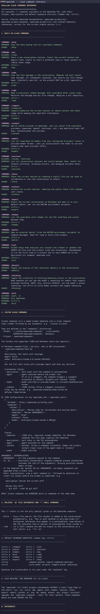

# OpenCode Setup Guides

A collection of setup guides for [opencode](https://opencode.ai), the AI coding
agent CLI. This repository contains documentation to install, run, and use
opencode both from the terminal and from Visual Studio Code.

## Contents

| File | Description |
|------|-------------|
| `guia-instalacion-y-ejecucion-opencode.md` | Spanish guide with full instructions to install and run opencode on Ubuntu 20.04 (tested on a 2 vCPU / 3.8 GiB RAM VM), including LLM provider authentication and VS Code integration. |
| `setup-github-repo-opencode.txt` | English guide explaining how to create a GitHub repository and manage it from the terminal with opencode. |
| `opencode-slash-commands.txt` | Reference of all `/` slash commands available in the opencode TUI (aliases, descriptions, keybinds) plus how to create custom commands. |

## Quick start

Install opencode:

```bash
curl -fsSL https://opencode.ai/install | bash
export PATH="$HOME/.opencode/bin:$PATH"
```

Run it inside your project:

```bash
opencode
```

The first time you run it, use `/init` to analyze your project and generate an
`AGENTS.md` with the project rules, and `/connect` to configure your LLM
provider API key.

## Resources

- Documentation: https://opencode.ai/docs
- Repository: https://github.com/FerGutierrez2020/opencode

## Slash commands reference (visual)



---

*Author: Fer Gutierrez, SageITTraining using OpenCode*